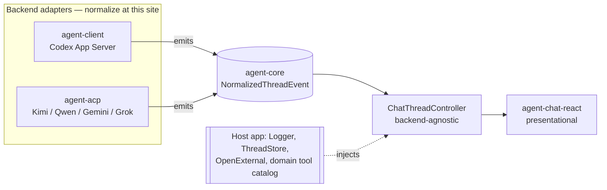
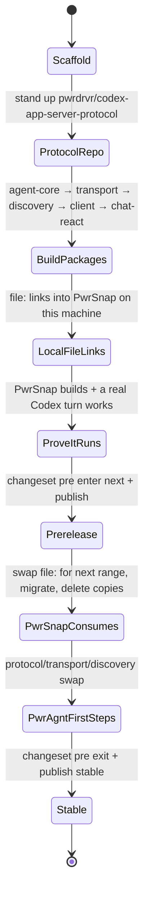

# feat: agent-kit monorepo buildout — shared Codex/ACP agent layer

**Target repo:** `agent-kit` (`git@github.com:pwrdrvr/agent-kit.git`) — a freshly-cloned,
empty public repo. All repo-relative paths in this plan are relative to that repo unless a
path is explicitly marked as a **source reference** in another repo (PwrSnap / PwrAgnt).

---

## Summary

Stand up the `pwrdrvr/agent-kit` pnpm monorepo and extract the shared "drive a local agent
over a JSON-RPC transport and present a consistent chat/tool experience" layer that PwrSnap
and PwrAgnt currently maintain as **hand-synced parallel copies** (PwrSnap's transport files
literally carry `// Lifted from PwrAgnt` headers). The extraction produces a small family of
independently-versioned **MIT** packages under the `@pwrdrvr/*` scope.

The kit **owns a neutral message/thread/tool-call schema**; every concrete agent backend
(Codex App Server now; Kimi/Qwen/Gemini/Grok over ACP in the companion plan) normalizes its
native event stream **into that schema at the adapter site** — the same move that made
PwrAgnt's message handling generic. Host apps inject the three things that are inherently
app-specific (a logger, a thread store, and an `openExternal` callback); the kit ships
**zero Electron and zero persistence**.

Distribution honors the PwrDrvr **no-`git`-dependency** rule: validate cross-repo with local
`file:` links first, publish to npm as a prerelease, migrate PwrSnap then PwrAgnt onto the
prereleases, then flip to stable. This plan is not "done" until PwrSnap actually consumes the
packages and PwrAgnt has taken its first consumption steps — see the companion migration plans.

---

## Problem Frame

The generic agent-driving layer is being built a 2nd, 3rd, and Nth time:

- **PwrSnap** and **PwrAgnt** keep parallel copies of the JSON-RPC core, stdio transport, and
  Codex discovery. They drift; the `// Lifted from PwrAgnt` headers are drift waiting to happen.
- **GIPHY Genius** is about to implement chat and has built only the *domain* half (deterministic
  tools + operation algebra + a stub panel); the generic half (transport, discovery, turn loop,
  run persistence, chat UI) is entirely unbuilt and is exactly what PwrSnap already has.
- 3+ more PwrDrvr apps (PwrGit, PwrSweep, PwrNote) each want AI enrichment + chat.

The code is already dependency-injected for extraction — `CodexThreadClient` "bakes in no chat
or idle-timing logic," and `ChatThreadController` already takes `catalog` / `dispatchToolCall` /
`buildSystemPrompt` / `store` / `broadcast` as injected deps (which is why PwrSnap's Library Chat
and Sizzle Reel chat are the *same class*). Someone designed this to be lifted. This plan lifts it.

---

## Goals

- A published `@pwrdrvr/*` package family that a downstream Electron/Node app can consume to:
  discover a local Codex install (incl. multiple auth profiles + relogin), open an App Server
  connection, run one-shot enrichment turns and long-lived chat threads, register app-defined
  tools, and render a chat surface — all against a **neutral** event schema.
- **End the PwrSnap↔PwrAgnt drift** on the transport/discovery layer by making both consume the
  same package.
- Establish the neutral schema + adapter-normalization seam so ACP agents (companion plan) and any
  future backend plug in without changing consumers.
- A reproducible local→prerelease→stable distribution flow that respects the no-`git`-refs rule.

## Non-Goals (Scope Boundaries)

**Out of this kit's identity (never belongs here):**
- Any app's **domain tool set** (PwrSnap's `draw_arrow`/`redact`/`crop`; GIPHY's `add_caption`),
  **prompts**, **enrichment schemas**, or **persistence implementations**.
- Anything **GIPHY-owned** — GIPHY Genius is `UNLICENSED`; it *consumes* the MIT packages
  one-directionally. Nothing GIPHY-specific flows into the kit.
- **Electron** itself. The kit is Node-library-shaped; the host injects `openExternal`, the
  logger, and the store.

**Deferred to companion plans (planned, not executed here):**
- The `@pwrdrvr/agent-acp` package and the neutral-normalizer for Kimi/Qwen/Gemini/Grok →
  `docs/plans/2026-06-02-002-feat-agent-kit-acp-multi-agent-plan.md`.
- PwrSnap consumer migration → PwrSnap `docs/plans/2026-06-02-001-feat-consume-agent-kit-plan.md`.
- PwrAgnt consumer migration → PwrAgnt `docs/plans/2026-06-02-002-feat-consume-agent-kit-plan.md`.

**Deferred to follow-up work:**
- `@pwrdrvr/codex-app-server-protocol` lives in its **own repo** (`pwrdrvr/codex-app-server-protocol`),
  not in this monorepo (see KTD-1). This plan stands it up and depends on it; its internal CI/release
  details are owned by that repo.
- GIPHY Genius / PwrGit / PwrSweep / PwrNote consumption — downstream, enabled-not-executed.

---

## Key Technical Decisions

### KTD-1 — The Codex protocol types live in a separate repo, not this monorepo

`@pwrdrvr/codex-app-server-protocol` is ~607 generated `.ts` files (output of
`codex app-server generate-ts --out ./src --experimental`, pinned to a Codex CLI version).
OpenAI ships **no** equivalent package — `@openai/codex-sdk` is a higher-level CLI-spawning
wrapper with no `--experimental` and no raw App Server surface; the only standalone packages are
unmaintained third-party ones we will not depend on (license hygiene). We therefore vendor our own.

It goes in its **own repo** (`pwrdrvr/codex-app-server-protocol`) so the 600-file regeneration
churn never pollutes `agent-kit` diffs. It is consumed by **version** (a normal npm dependency),
not by source, so it can be public or private with zero design change. *Rationale: isolates churn,
keeps the monorepo reviewable, and matches how PwrSnap/PwrAgnt already consume their vendored copy.*

### KTD-2 — The kit owns a neutral schema; backends normalize at the adapter site

A single `@pwrdrvr/agent-core` package defines the neutral `NormalizedThreadEvent` /
`NormalizedThread` / `NormalizedToolCall` vocabulary plus the injected interfaces (`Logger`,
`ThreadStore`, `Clock`, `OpenExternal`). Every backend adapter (`agent-client` for Codex,
`agent-acp` for ACP agents) depends on `agent-core` and **emits agent-core types** — never its own
native shape. *Rationale: this is the move that made PwrAgnt message handling generic and is the
user-endorsed approach. Consumers and `agent-chat-react` bind to one schema regardless of backend;
adding Grok/Gemini/Kimi/Qwen later changes only an adapter, never a consumer.* This is the single
load-bearing design decision of the whole kit. PwrAgnt's existing normalizer (`acp-session-normalizer.ts`)
is the proven logic to port, but it currently emits **PwrAgnt's** `AppServerThreadReplay` types —
the port re-targets it onto `agent-core`'s neutral schema (detailed in the ACP companion plan).

### KTD-3 — Zero Electron, zero persistence in the kit; host injects three seams

The three coupling seams identified during research become constructor injection:
1. **Logger** — every PwrSnap/PwrAgnt transport file imports `getMainLogger`. → `Logger` interface.
2. **Thread store** — `ChatThreadController.recordUsage` calls `saveAiThreadUsage`/`estimateAiUsageCost`
   directly and `ChatThreadStore` is `better-sqlite3`-backed. → `ThreadStore` interface; the SQLite
   impl stays in each app.
3. **Identity + platform** — hardcoded `clientInfo.name: "pwrsnap"`, `serviceName`, the
   `PWRSNAP_CODEX_COMMAND` env name, and `shell.openExternal` in the login flow. → config object +
   `OpenExternal` callback.

### KTD-4 — Package DAG (six `@pwrdrvr/*` packages + one external protocol dep)

```
@pwrdrvr/agent-core           (neutral schema + injected interfaces; zero deps)
@pwrdrvr/agent-transport      (JSON-RPC 2.0 core + stdio transport)        → agent-core
@pwrdrvr/codex-discovery      (binary discovery, version compare, auth      → agent-core
                               profiles, login/relogin flow)
@pwrdrvr/agent-client         (Codex App Server adapter: thread client +    → agent-core, agent-transport,
                               chat controller + defineTool; normalizes        codex-discovery,
                               into agent-core schema)                          @pwrdrvr/codex-app-server-protocol
@pwrdrvr/agent-acp            (ACP adapter; companion plan)                 → agent-core, agent-transport
@pwrdrvr/agent-chat-react     (presentational chat UI; React peer dep)     → agent-core
```

*Rationale: a strict DAG with `agent-core` as the hub means each package builds and versions
independently, and React is quarantined to one leaf so CLI/Node consumers never pull it in.*

### KTD-5 — Build/release tooling

- **pnpm workspaces** + **TypeScript project references** (`composite: true`) for fast incremental
  builds, matching the repo conventions (`strict`, `exactOptionalPropertyTypes`, `verbatimModuleSyntax`,
  ESM, `moduleResolution: Bundler`, target ES2023). Node `v24.14.1`, pnpm `10.33.0` (pinned to match
  all consumers).
- **tsup** per package for dual builds (ESM + `.d.ts`); each package ships `exports` map, `types`, ESM.
- **Changesets** for independent versioning + the prerelease (`next` tag) → stable flow.
- **GitHub Actions**: build + typecheck + test on PR; `changesets/action` publishes on merge.

### KTD-6 — Distribution flow (honors no-`git`-deps)

`file:` links on this machine (prove cross-repo consumption actually compiles + runs) →
`pnpm changeset pre enter next` + publish prereleases to npm → PwrSnap swaps `file:` for the
prerelease range and migrates → PwrAgnt takes first steps → `pnpm changeset pre exit` + publish
stable → consumers flip to caret ranges. **No `git+https` / `github:` dependency ranges at any
point** (PwrDrvr policy).

---

## High-Level Technical Design

### Backend-adapter normalization (the KTD-2 seam)



Consumers (`ChatThreadController`, `agent-chat-react`) only ever see `agent-core` types. Swapping or
adding a backend touches an adapter, never a consumer — this is what "consistent experience across
agents" means in code.

### Distribution + cross-repo validation lifecycle



---

## Output Structure

```
agent-kit/
├── package.json                 # private root; workspaces; scripts
├── pnpm-workspace.yaml
├── tsconfig.base.json           # strict, exactOptionalPropertyTypes, ESM, ES2023
├── .nvmrc                       # v24.14.1
├── .changeset/                  # changesets config
├── .github/workflows/
│   ├── ci.yml                   # build + typecheck + test on PR
│   └── release.yml              # changesets publish on merge
├── packages/
│   ├── agent-core/              # neutral schema + injected interfaces
│   ├── agent-transport/         # json-rpc + stdio
│   ├── codex-discovery/         # discovery + profiles + login
│   ├── agent-client/            # Codex App Server adapter
│   ├── agent-acp/               # ACP adapter (scaffold here; built in companion plan)
│   └── agent-chat-react/        # presentational chat UI
├── examples/
│   └── minimal-consumer/        # tiny Node harness used for file:-link validation (U11)
└── docs/plans/                  # this plan + the ACP companion plan
```

---

## Implementation Units

Grouped into phases that match the confirmed ordering. The protocol repo (U2) is technically a
separate repository; it is listed here because the master plan owns the sequencing.

### Phase A — Repo + tooling foundation

#### U1. Scaffold the monorepo

- **Goal:** A buildable empty pnpm + TS-project-references monorepo with CI, changesets, and shared config.
- **Dependencies:** none.
- **Files:** `package.json`, `pnpm-workspace.yaml`, `tsconfig.base.json`, `.nvmrc`, `.gitignore`,
  `.changeset/config.json`, `.github/workflows/ci.yml`, `.github/workflows/release.yml`, `LICENSE` (MIT),
  `README.md`.
- **Approach:** Mirror the PwrSnap/PwrAgnt root tsconfig flags (KTD-5). Root `package.json` is `private: true`
  with `"packageManager": "pnpm@10.33.0"`. CI runs `pnpm -r build` + `pnpm -r typecheck` + `pnpm -r test`.
  Add a license-policy gate equivalent to PwrSnap's `check-package-license-policy.mjs` so every package stays MIT.
- **Patterns to follow:** PwrSnap root `package.json`, `tsconfig.base.json`, `scripts/check-package-license-policy.mjs`
  (source references, PwrSnap repo).
- **Test scenarios:** `Test expectation: none — scaffolding`. Verification is `pnpm -r build` succeeds on an
  empty workspace and CI is green on the first PR.
- **Verification:** `pnpm install && pnpm -r build` exits 0; CI workflow runs on the scaffolding PR.

### Phase B — Protocol types (separate repo)

#### U2. Stand up `pwrdrvr/codex-app-server-protocol` and publish it

- **Goal:** A published `@pwrdrvr/codex-app-server-protocol` consumed by `agent-client`.
- **Dependencies:** none (parallel with U1).
- **Files (in the `codex-app-server-protocol` repo, not agent-kit):** `package.json` (name
  `@pwrdrvr/codex-app-server-protocol`, `generate` script), `src/**` (generated), `README.md`
  documenting the `generate` command + pinned Codex version, CI.
- **Approach:** Port PwrSnap's `packages/codex-app-server-protocol` verbatim — it already has zero
  `pwrsnap` strings in `src/`. Rename scope `@pwrsnap/` → `@pwrdrvr/`, rename the env override
  (`PWRSNAP_CODEX_BIN` → `PWRDRVR_CODEX_BIN`). `generate` script:
  `${PWRDRVR_CODEX_BIN:-/Applications/Codex.app/Contents/Resources/codex} app-server generate-ts --out ./src --experimental`.
  Expose `.` (v1) and `/v2` subpath exports as PwrSnap does. Publish prerelease first (U10 flow), then stable.
- **Patterns to follow:** PwrSnap `packages/codex-app-server-protocol/package.json` (source reference).
- **Test scenarios:** `Test expectation: none — generated types`. A `tsc --noEmit` over `src/` is the only gate.
- **Verification:** `pnpm --filter @pwrdrvr/codex-app-server-protocol build` type-checks; the package
  imports cleanly from `agent-client` (U7).

### Phase C — Core schema + transport + discovery

#### U3. `@pwrdrvr/agent-core` — neutral schema + injected interfaces

- **Goal:** The dependency hub: neutral event/thread/tool vocabulary and the injection interfaces.
- **Requirements:** advances KTD-2, KTD-3.
- **Dependencies:** U1.
- **Files:** `packages/agent-core/src/schema/thread-events.ts`, `.../schema/tool-call.ts`,
  `.../interfaces/logger.ts`, `.../interfaces/thread-store.ts`, `.../interfaces/platform.ts`
  (`OpenExternal`, `Clock`), `.../index.ts`; `packages/agent-core/test/schema.test.ts`.
- **Approach:** Define `NormalizedThreadEvent` (a discriminated union: `agent_message_delta`,
  `tool_call`, `tool_call_update`, `turn_completed`, `token_usage`, `approval_request`, `thread_settings`),
  `NormalizedThread`, `NormalizedToolCall` (uniform `{ id, kind: read|write|command|other, label, status }`).
  This is the contract every backend normalizes **into**. Distill the field set from PwrSnap's
  `CodexThreadClient` pub-sub hooks **and** PwrAgnt's `AppServerThreadReplay` so both backends fit; where
  they disagree, the neutral schema is the superset that loses no information either backend carries.
  `Logger`/`ThreadStore`/`Clock`/`OpenExternal` are minimal interfaces, no concrete impls.
- **Patterns to follow:** PwrSnap `apps/desktop/src/main/ai/codex-thread-client.ts` hook signatures;
  PwrAgnt `packages/shared/src/contracts/normalized-app-server.ts` (source references).
- **Test scenarios:**
  - Happy path: a sample Codex-shaped event sequence type-checks against `NormalizedThreadEvent`.
  - Happy path: a sample ACP-shaped tool-call maps onto `NormalizedToolCall` with `kind` inferred.
  - Edge: an event carrying both camelCase and snake_case source fields is representable post-normalization
    (the schema is the normalized target, so this asserts the target is lossless).
  - Type boundary: `ThreadStore` mock satisfies the interface with an in-memory impl.
- **Verification:** `agent-transport`, `codex-discovery`, `agent-client` all import `agent-core` types
  without a circular dependency (project-reference graph builds).

#### U4. `@pwrdrvr/agent-transport` — JSON-RPC core + stdio

- **Goal:** Generic JSON-RPC 2.0 client/server + line-delimited stdio transport, backend-agnostic.
- **Dependencies:** U3.
- **Files:** `packages/agent-transport/src/json-rpc.ts`, `.../stdio-transport.ts`, `.../index.ts`;
  `packages/agent-transport/test/json-rpc.test.ts`, `.../test/stdio-transport.test.ts`.
- **Approach:** Port PwrSnap `codex-app-server/json-rpc.ts` (pending-request map, timeouts, notifications,
  server-request handler, message observer) and `stdio-transport.ts`. Replace the `../log` import with an
  injected `Logger` from `agent-core`. Keep the `JsonRpcTransport` interface intact — ACP reuses this exact
  core (PwrAgnt's `AcpStdioJsonRpcTransport` wraps the same `JsonRpcConnection`). The spawn target
  (binary + args) is a parameter, not hardcoded to Codex.
- **Patterns to follow:** PwrSnap `apps/desktop/src/main/codex-app-server/{json-rpc,stdio-transport}.ts`
  (source references).
- **Test scenarios:**
  - Happy path: a request resolves with the matching response by id; a notification fires its handler.
  - Edge: a request that never gets a response rejects after the timeout.
  - Edge: interleaved responses for concurrent requests resolve to the correct callers.
  - Error path: malformed/partial JSON lines across stdio chunk boundaries reassemble correctly (line buffering).
  - Error path: a server-initiated request routes to the registered handler and its reply is written back.
  - Integration: spawn a fake echo subprocess, round-trip a request over real stdio.
- **Verification:** `json-rpc.test.ts` covers concurrent + timeout + server-request paths; stdio test
  round-trips against a child process.

#### U5. `@pwrdrvr/codex-discovery` — discovery, version compare, profiles, login

- **Goal:** Discover local Codex binaries (version-ranked), enumerate/select **auth profiles**, validate
  login, and drive **relogin** — the multi-profile capability PwrSnap lacks and wants.
- **Requirements:** advances KTD-3; brings PwrAgnt's profile/relogin feature into the shared layer.
- **Dependencies:** U3.
- **Files:** `packages/codex-discovery/src/command-discovery.ts`, `.../codex-discovery.ts`,
  `.../codex-profiles.ts`, `.../codex-login.ts`, `.../types.ts`, `.../index.ts`;
  `packages/codex-discovery/test/{command-discovery,codex-discovery,codex-profiles,codex-login}.test.ts`.
- **Approach:** Take **PwrAgnt's** discovery (richer than PwrSnap's): the generic `command-discovery.ts`
  engine (PATH resolution incl. Windows `PATHEXT`, executability checks, version probe w/ timeout, dedup,
  documented `env > config > best-auto` priority), `codex-discovery.ts` (min-version gate `0.125.0`,
  `compareCodexCliVersions` w/ prerelease ordering, platform install-location search, Homebrew
  version-without-execution, `CodexCliNotInstalledError`). Add **`codex-profiles.ts`** (`CODEX_HOME`
  enumeration under `~/.codex/profiles/`, `auth.json` presence, JWT identity extraction — email/plan,
  defensive parse) and **`codex-login.ts`** (`collectCodexStatus` via `codex login status`;
  `startCodexProfileLoginProcess` spawning `codex login`, scraping the OAuth URL, calling the injected
  `OpenExternal`, tracking active login children, 8s URL-surface timeout, re-check on close). Profile
  *persistence* is the host's job (a `profile` string) — the package resolves a profile to a `CODEX_HOME`
  env and surfaces status; it does not own where the selection is stored.
- **Patterns to follow:** PwrAgnt `apps/desktop/src/main/settings/{command-discovery,codex-discovery,codex-profiles}.ts`
  and the login flow in `apps/desktop/src/main/ipc/settings.ts` (`collectCodexStatus`,
  `startCodexProfileLoginProcess`, `parseCodexLoginPrompt`) — source references, PwrAgnt repo.
- **Test scenarios:**
  - Happy path: discovery returns candidates sorted newest-first; `env > config > auto` priority honored.
  - Edge: a too-old binary is surfaced as a candidate with `failureReason: "codex_too_old"`, not dropped.
  - Edge: PATH entry quoting / Windows `PATHEXT` expansion resolves the right executable.
  - Edge: Homebrew cask path yields a version without executing the binary.
  - Profiles happy path: enumerate default `~/.codex` (`name: ""`) plus named subdirs; `hasAuthFile` correct.
  - Profiles edge: a corrupt/short `auth.json` yields `{}` identity, never throws.
  - Login happy path: `codex login status` exit 0 → `authenticated` with email/plan parsed from the JWT.
  - Login path: `startCodexProfileLoginProcess` scrapes the OAuth URL, invokes the injected `OpenExternal`,
    and re-invocation kills the prior login child for that profile.
  - Error path: `codex login` that never prints a URL still resolves via the 8s timeout with a clear status.
  - Error path: no Codex installed → `CodexCliNotInstalledError`, not `ENOENT`.
- **Verification:** discovery + profile + login suites pass against fixture filesystems and a fake `codex`
  shim; the package never imports Electron (login uses the injected `OpenExternal`).

### Phase D — Codex adapter + chat UI

#### U6. `@pwrdrvr/agent-client` — Codex thread client + one-shot client (normalizing)

- **Goal:** The Codex App Server adapter: connection lifecycle, long-lived multi-turn threads, one-shot
  structured-output enrichment turns — all **emitting `agent-core` events**.
- **Requirements:** advances KTD-2, KTD-3.
- **Dependencies:** U3, U4, U5, U2 (`@pwrdrvr/codex-app-server-protocol`).
- **Files:** `packages/agent-client/src/codex-thread-client.ts`, `.../codex-oneshot-client.ts`,
  `.../codex-thread-config.ts`, `.../normalize.ts`, `.../index.ts`;
  `packages/agent-client/test/{codex-thread-client,codex-oneshot-client,normalize}.test.ts`.
- **Approach:** Port PwrSnap `CodexThreadClient` (already "no chat/idle logic baked in"): `startThread`,
  `resumeThread`, `startTurn`, `interruptTurn`, `archiveThread`, plus the pub-sub hooks — but route each
  native notification through `normalize.ts` so subscribers receive **`NormalizedThreadEvent`**, not raw
  protocol shapes (this is the adapter-site normalization for the Codex backend; the ACP adapter mirrors it
  in the companion plan). Parameterize `clientInfo.name` / `serviceName` (KTD-3). Port the one-shot
  enrichment turn machinery (`outputSchema` structured output, `localImage` file-path `UserInput`, refuse
  tool calls, persistent-worker-thread + per-turn rollback) as `codex-oneshot-client.ts` — generic
  mechanics only; the **schema/prompt are supplied by the caller**, not baked in. Port
  `codex-thread-config.ts` (the "disable Codex coding-agent scaffolding" overlay) as generic config.
- **Patterns to follow:** PwrSnap `apps/desktop/src/main/ai/{codex-thread-client,codex-client,codex-thread-config}.ts`
  (source references).
- **Test scenarios:**
  - Happy path: `startTurn` streams `agent_message_delta` normalized events, then `turn_completed`.
  - Happy path (one-shot): a turn with a caller-supplied `outputSchema` returns the parsed object; image
    input is passed as a `localImage` file path (not base64).
  - Edge: two concurrent threads keep independent turn state (no singleton bleed).
  - Edge: `interruptTurn` mid-stream surfaces a terminal normalized event.
  - Error path: a backend tool call during a one-shot enrichment turn is refused.
  - Integration: `normalize.ts` maps a recorded real Codex notification stream into the exact
    `NormalizedThreadEvent` sequence (golden fixture).
  - Integration: connection lifecycle (initialize → thread → turn → archive) over a faked transport.
- **Verification:** golden-fixture normalization test passes; `clientInfo.name` is configurable (asserted);
  no `pwrsnap`/`pwragent` literals remain.

#### U7. `ChatThreadController` (in `agent-client`) — backend-agnostic turn orchestration

- **Goal:** The multi-surface chat controller, depending only on `agent-core` + an injected store/catalog.
- **Requirements:** advances KTD-2, KTD-3.
- **Dependencies:** U6.
- **Files:** `packages/agent-client/src/chat/chat-thread-controller.ts`, `.../chat/define-tool.ts`,
  `.../chat/tool-catalog.ts`, `.../chat/index.ts`; `packages/agent-client/test/chat/{chat-thread-controller,define-tool}.test.ts`.
- **Approach:** Port PwrSnap `ChatThreadController` (per-thread `TurnState` map, settings snapshot at turn
  start, streaming, approval flow keyed `(threadId,turnId,approvalId)`, rate limiting). Replace the direct
  `saveAiThreadUsage`/`estimateAiUsageCost` calls with the injected `ThreadStore` (KTD-3). Port
  `define-tool.ts` (`defineTool` = description + zod `argsSchema` + a `dispatch`; `toDynamicToolSpec` via
  `z.toJSONSchema()`) and the generic catalog builder/dispatcher. The tool **dispatch** target is injected
  by the host (PwrSnap routes to its command bus; GIPHY routes to `agent:runProjectTool`) — the kit defines
  the contract, not the tools.
- **Patterns to follow:** PwrSnap `apps/desktop/src/main/ai/{chat-thread-controller,define-tool,library-tool-catalog}.ts`
  (source references). Note Library Chat + Sizzle Chat are the same controller — preserve that generality.
- **Test scenarios:**
  - Happy path: a registered tool's `defineTool` spec serializes to a valid `DynamicToolSpec` wire schema.
  - Happy path: a `tool_call` event dispatches to the matching handler and the result is returned to the turn.
  - Edge: a stale turn resolution (late `seq`) does not clobber newer state.
  - Edge: approval request for `(threadId,turnId,approvalId)` resolves to the correct waiting turn.
  - Error path: a tool call for an unknown/un-allowlisted tool is rejected, not dispatched.
  - Error path: rate-limit breach surfaces a terminal normalized event without crashing the thread.
  - Integration: usage is recorded through the injected `ThreadStore` (mock asserts the write), not a
    hardcoded persistence call.
- **Verification:** controller drives a full turn over the faked client + mock store; no persistence import
  remains in the package.

#### U8. `@pwrdrvr/agent-chat-react` — presentational chat surface

- **Goal:** A reusable, purely-presentational React chat kit (message list, composer, approval modal).
- **Dependencies:** U3.
- **Files:** `packages/agent-chat-react/src/{MessageList,Composer,ChatApprovalModal,index}.tsx`,
  `.../chat.css`; `packages/agent-chat-react/test/MessageList.test.tsx`.
- **Approach:** Port PwrSnap `renderer/src/features/shared/chat/*` (already "props in, callbacks out, no
  bus/IPC wiring"). Props are typed against `agent-core` neutral events so the UI is backend-agnostic.
  React is a **peer dependency**; this is the only package that touches React.
- **Patterns to follow:** PwrSnap `apps/desktop/src/renderer/src/features/shared/chat/` (source reference).
- **Test scenarios:**
  - Happy path: renders a sequence of normalized message + tool-call events into the expected DOM.
  - Edge: an in-progress streaming delta renders incrementally; a tool-call card shows status transitions.
  - Edge: approval modal fires the `onApprove`/`onDeny` callbacks with the right ids.
  - `Test expectation:` no network/IPC — pure render + callback assertions only.
- **Verification:** component tests render against fixture event streams; package has no non-React runtime dep.

### Phase E — Validate, publish, migrate

#### U9. `examples/minimal-consumer` — cross-repo validation harness

- **Goal:** A tiny Node harness that exercises discovery → connect → one real turn, used to prove the
  packages work before any app migration.
- **Dependencies:** U6 (U8 optional).
- **Files:** `examples/minimal-consumer/{package.json,src/main.ts,README.md}`.
- **Approach:** A ~50-line script: discover Codex, open a thread, run one turn, print the normalized event
  stream, register one trivial tool and prove dispatch. Consumes the packages by workspace link inside the
  monorepo, and is the thing PwrSnap will consume by `file:` link in U10.
- **Test scenarios:** `Test expectation: none — example/manual harness`. It IS the manual verification.
- **Verification:** `pnpm --filter minimal-consumer start` completes a real Codex turn against a logged-in
  profile and prints normalized events.

#### U10. `file:`-link validation → npm prerelease publish

- **Goal:** Prove the packages compile + run **inside PwrSnap** via `file:` links, then publish prereleases.
- **Requirements:** KTD-6.
- **Dependencies:** U6, U8, U9; coordinates with PwrSnap migration plan.
- **Files:** `.changeset/*` (initial changesets), `.github/workflows/release.yml` (prerelease mode).
- **Approach:** On this machine, point PwrSnap's `package.json` deps at `file:../../agent-kit/packages/*`
  (per PwrDrvr no-`git`-refs rule — local file links are allowed, git refs are not), confirm PwrSnap builds
  and a real chat turn works end-to-end. Then `pnpm changeset pre enter next`, version, and publish all
  packages (+ the protocol package from its own repo) to npm under the `next` dist-tag.
- **Test scenarios:** `Test expectation: none — release mechanics`. Verification is consumption-based.
- **Verification:** PwrSnap builds against `file:` links and runs a real turn; `npm view @pwrdrvr/agent-core@next`
  resolves after publish.

#### U11. Drive the consumer migrations (reference companion plans)

- **Goal:** PwrSnap fully migrated; PwrAgnt's first steps taken — so the extraction is actually "finished."
- **Dependencies:** U10.
- **Files:** none in this repo — work lands in PwrSnap and PwrAgnt per their plans.
- **Approach:** Execute PwrSnap `docs/plans/2026-06-02-001-feat-consume-agent-kit-plan.md` (swap transport +
  discovery + client + chat-react onto `@pwrdrvr/*@next`, delete the hand-synced copies, adopt multi-profile +
  relogin as a bonus). Execute the **first steps** of PwrAgnt
  `docs/plans/2026-06-02-002-feat-consume-agent-kit-plan.md` (protocol + transport + discovery swap). Each
  lands as its own PR in its own repo.
- **Test scenarios:** owned by the companion plans (their unit test scenarios).
- **Verification:** PwrSnap CI green on `@pwrdrvr/*@next`; PwrAgnt protocol/transport/discovery swap PR green.

#### U12. Flip to stable

- **Goal:** Exit prerelease; consumers on caret ranges.
- **Dependencies:** U11 (PwrSnap green on `next`).
- **Files:** `.changeset/*`.
- **Approach:** `pnpm changeset pre exit`, version, publish stable. Update PwrSnap (and PwrAgnt where migrated)
  from `@pwrdrvr/*@next` to `^x.y.z`. Announce the API as stable in each package README.
- **Test scenarios:** `Test expectation: none — release mechanics`.
- **Verification:** `npm view @pwrdrvr/agent-core version` shows a stable (non-prerelease) version; consumers
  build on caret ranges.

---

## Risks & Mitigations

- **Neutral-schema lossiness (highest risk).** If `agent-core`'s schema can't represent something a backend
  carries, consumers lose information and the abstraction leaks. *Mitigation:* derive the schema from the
  **union** of PwrSnap's Codex hooks and PwrAgnt's `AppServerThreadReplay` before writing adapters (U3 before
  U6/ACP); golden-fixture normalization tests (U6) catch regressions; treat the ACP companion plan as the real
  stress test and budget for a schema revision after it.
- **Codex protocol version skew.** Consumers must agree on a protocol package version. *Mitigation:* the
  protocol package is version-pinned and consumed by range; document the pinned Codex CLI version in its README;
  bump deliberately.
- **Churn from regeneration polluting reviews.** *Mitigation:* KTD-1 isolates it to its own repo.
- **Prerelease coordination across 3 repos.** *Mitigation:* `file:` validation (U10) precedes any publish; the
  `next` tag keeps stable consumers unaffected; flip-to-stable (U12) is gated on PwrSnap being green.
- **License contamination.** *Mitigation:* MIT-only license gate in CI (U1); nothing GIPHY-owned enters the kit;
  ACP registry allowlist (companion plan) keeps GPL-family agents out.

---

## Dependencies / Sequencing

`U1 ∥ U2` → `U3` → `U4 ∥ U5` → `U6` → `U7 ∥ U8` → `U9` → `U10` → `U11` → `U12`.
ACP (`agent-acp`) is scaffolded empty in U1's workspace and built entirely in the companion plan; it depends on
`U3` (schema) and `U4` (transport) but not on the Codex adapter.

---

## Sources & Research

- **Protocol landscape (load-bearing, shaped KTD-1):** OpenAI ships `@openai/codex` (CLI) and
  `@openai/codex-sdk` (high-level CLI-spawning SDK, no `--experimental`, no raw App Server surface); the raw
  protocol types are a per-version `codex app-server generate-ts --experimental` artifact, not a package; only
  third-party/unmaintained standalone packages exist. → we vendor our own in a separate repo.
  - [Codex App Server docs](https://developers.openai.com/codex/app-server)
  - [app-server README (openai/codex)](https://github.com/openai/codex/blob/main/codex-rs/app-server/README.md)
  - [@openai/codex-sdk](https://www.npmjs.com/package/@openai/codex-sdk) · [@openai/codex](https://www.npmjs.com/package/@openai/codex)
- **Source repos (extraction origins):** PwrSnap (`apps/desktop/src/main/{codex-app-server,ai,settings}/`,
  `renderer/src/features/shared/chat/`, `packages/codex-app-server-protocol/`) and PwrAgnt
  (`apps/desktop/src/main/{acp,settings,app-server}/`, `apps/desktop/src/main/ipc/settings.ts`,
  `packages/shared/src/contracts/`). Both MIT / © PwrDrvr LLC.
- **Consumer:** GIPHY Genius is a structural twin (Electron 41 / electron-vite 5 / pnpm 10.33 / `better-sqlite3` /
  `Result<T,E>` / single command-bus with an `agent` principal already cut), domain-half-built, generic-half-empty.
