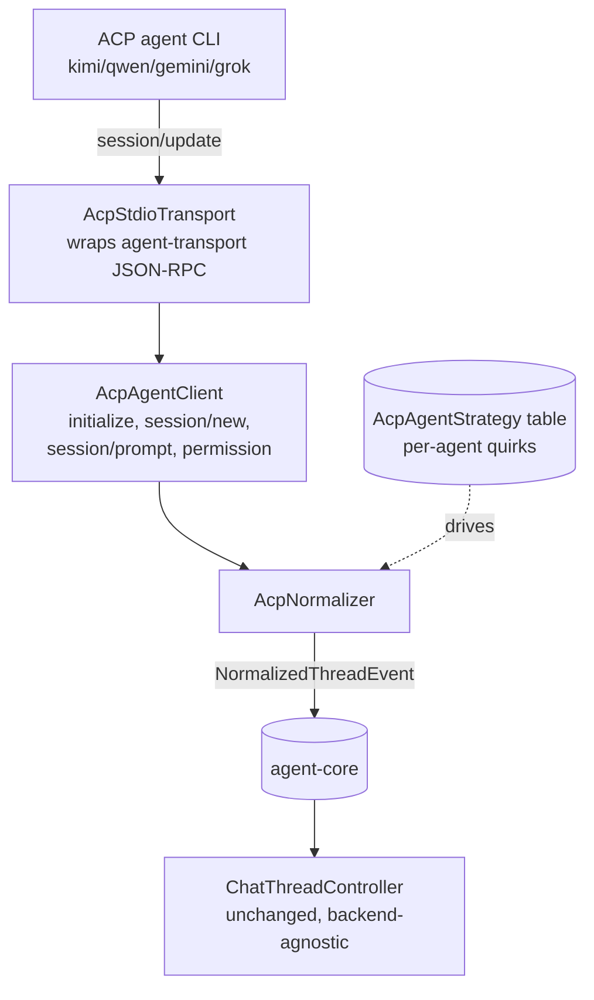
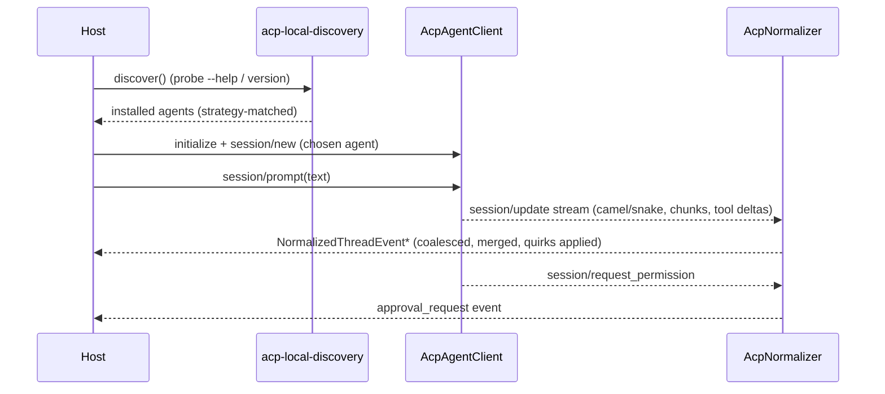

# feat: agent-kit ACP — multi-agent backend (Kimi, Qwen, Gemini, Grok)

**Target repo:** `agent-kit`. Repo-relative paths are relative to that repo; paths marked
**source reference** live in the PwrAgnt repo (the extraction origin).

This is the companion to the [master buildout plan](2026-06-02-001-feat-agent-kit-monorepo-buildout-plan.md).
It builds `@pwrdrvr/agent-acp`: a second backend adapter that normalizes ACP agents into the **same**
`@pwrdrvr/agent-core` neutral schema the Codex adapter emits. The end-state target is concrete: a host app
(PwrSnap first) can drive **Kimi, Qwen, Gemini, and Grok** through the exact same `ChatThreadController` and
`@pwrdrvr/agent-chat-react` surface it uses for Codex, with no consumer-side branching per agent.

---

## Summary

PwrAgnt already solved "make ACP present a consistent experience across different agents" — ~5k LOC under
`apps/desktop/src/main/acp/`. The valuable, hard-won asset is the **normalizer** (`acp-session-normalizer.ts`):
camel/snake tolerance on every field, agent-message chunk coalescing, `tool_call`→`tool_call_update` merge,
and per-agent quirk handling (suppress Qwen thoughts, parse Grok topic-updates into titles). Today it normalizes
ACP's messy stream **into PwrAgnt's** `AppServerThreadReplay` types. This plan ports that logic but **re-targets
it onto `agent-core`'s neutral schema** (KTD-2 of the master plan) — normalizing at the adapter site so consumers
never see ACP's shape. It also ports the ACP transport, protocol client, local agent discovery, and the registry
allowlist, and turns PwrAgnt's inline per-agent `if (backendId === ...)` branches into a registered **per-agent
strategy table** so adding an agent is a table entry, not a normalizer edit.

---

## Problem Frame

ACP agents differ in maddening ways: camelCase vs snake_case on the same field, nested content blocks,
streamed tool-call deltas with generic-then-specific labels, thought chunks some agents emit and others don't,
vendor extensions (Grok's `_x.ai/session_notification`). PwrAgnt absorbed all of this — but the absorption is
coupled to PwrAgnt's domain vocabulary and the integration is only half-abstracted: Codex/Grok are polymorphic
behind a `BackendClient` interface, but ACP is special-cased at 40+ inline `isAcpBackendId(...)` sites in a
~10k-line `DesktopBackendRegistry`. We want the *normalization logic* without the *PwrAgnt coupling*, and we want
the clean polymorphism PwrAgnt never finished: every backend (Codex, ACP-of-N-agents) emits `agent-core` events,
full stop.

---

## Goals

- `@pwrdrvr/agent-acp` normalizes ACP `session/update` streams into `NormalizedThreadEvent` (agent-core), losslessly.
- A **per-agent strategy table** (Kimi, Qwen, Gemini, Grok) carrying each agent's quirks + local-discovery probe +
  spawn invocation, so a 5th agent is an added entry.
- Local discovery of installed ACP CLIs and a registry path gated by a license/pinning allowlist (no GPL-family,
  no unpinned packages, Codex explicitly excluded from the ACP path — it has a first-class App Server adapter).
- PwrSnap can select an ACP agent and chat with it through the unchanged controller + React surface.

## Non-Goals (Scope Boundaries)

**Out of this kit's identity:**
- PwrAgnt's `DesktopBackendRegistry` — that is the *application*, not the kit. We do not port the registry; we
  build the clean `AgentBackend` polymorphism it only half-achieved.
- Any agent's auth/account UI, or app-specific thread persistence.

**Deferred to follow-up work:**
- ACP **permission/approval** UX parity beyond surfacing `session/request_permission` as a neutral
  `approval_request` event (the controller already handles approvals generically).
- Agents beyond the initial four (the strategy table makes these additive).
- PwrSnap's UI for *picking* an ACP agent — planned in the PwrSnap migration plan's follow-up, enabled here.

---

## Key Technical Decisions

### KTD-A1 — Normalize ACP into `agent-core`, not a new schema

The ACP adapter emits the **same** `NormalizedThreadEvent` union the Codex adapter emits. If ACP carries
something the neutral schema can't hold, the fix is to widen `agent-core` (master plan U3) — shared by both
backends — never to introduce an ACP-specific output type. *Rationale: one schema is the whole point; two schemas
re-creates the per-agent branching we're trying to delete.*

### KTD-A2 — Per-agent behavior is a registered strategy table, not inline branches

PwrAgnt's `shouldSurfaceAcpThoughtsAsMessages(backendId)`, topic-update parsing, mode-update filtering, and
vendor-notification handling become fields on an `AcpAgentStrategy` record: `{ id, displayName, discoveryProbe,
spawn, quirks: { surfaceThoughts, titleFrom, ... } }`. The normalizer reads strategy fields; it has no
`if (id === 'qwen')`. *Rationale: a published kit must let consumers add agents without forking the normalizer.*

### KTD-A3 — Reuse `@pwrdrvr/agent-transport`; ACP is a backend like any other

The ACP stdio transport wraps the **same** JSON-RPC core as the Codex transport (PwrAgnt already does this —
`AcpStdioJsonRpcTransport` wraps `JsonRpcConnection`). `agent-acp` exposes an `AgentBackend` whose surface matches
what `ChatThreadController` consumes, so the controller drives Codex and ACP identically. *Rationale: finishes the
polymorphism PwrAgnt left half-built; deletes the consumer-side `isAcpBackendId` branching by construction.*

---

## High-Level Technical Design

### ACP normalization pipeline (the strategy-table seam)

### Agent lifecycle (consistent across all four agents)

---

## Implementation Units

### U20. ACP transport + protocol client

- **Goal:** Speak ACP over stdio against the shared JSON-RPC core.
- **Dependencies:** master U4 (`@pwrdrvr/agent-transport`).
- **Files:** `packages/agent-acp/src/acp-stdio-transport.ts`, `.../acp-client.ts`, `.../acp-protocol-types.ts`,
  `.../index.ts`; `packages/agent-acp/test/acp-client.test.ts`.
- **Approach:** Port PwrAgnt `acp-stdio-transport.ts` (wrap `agent-transport`'s JSON-RPC connection) and
  `acp-client.ts` verbs: `initialize` (protocolVersion 1, client capabilities), `session/new`, `session/prompt`,
  `session/cancel`, `session/set_mode|set_model|set_config_option`, inbound `session/request_permission`, and
  `session/update` dispatch. Keep vendor-extension routing (e.g. Grok `_x.ai/session_notification`) but behind the
  strategy table (U22), not inline.
- **Patterns to follow:** PwrAgnt `apps/desktop/src/main/acp/{acp-stdio-transport,acp-client}.ts` (source references).
- **Test scenarios:**
  - Happy path: `initialize` → `session/new` → `session/prompt` round-trips against a fake ACP subprocess.
  - Edge: inbound `session/request_permission` is surfaced to a registered handler.
  - Edge: `session/cancel` terminates an in-flight prompt cleanly.
  - Error path: an agent that responds with snake_case method params is still parsed.
  - Integration: app-id ↔ agent-session-id mapping holds across multiple concurrent sessions.
- **Verification:** client suite passes against a scripted fake-agent harness.

### U21. ACP normalizer → `agent-core` (the crown jewel port)

- **Goal:** Fold the ACP `session/update` stream into `NormalizedThreadEvent`, losslessly, with all of PwrAgnt's
  smoothing behaviors.
- **Requirements:** KTD-A1.
- **Dependencies:** U20, master U3 (`agent-core`).
- **Files:** `packages/agent-acp/src/normalizer/acp-normalizer.ts`, `.../normalizer/content.ts`,
  `.../normalizer/tool-activity.ts`, `.../normalizer/runtime-capabilities.ts`;
  `packages/agent-acp/test/normalizer/{acp-normalizer,tool-activity}.test.ts` + golden fixtures under
  `packages/agent-acp/test/fixtures/`.
- **Approach:** Port PwrAgnt `acp-session-normalizer.ts` logic re-targeted onto `agent-core`: camel/snake tolerance
  (`readString`/`readKind`/`readContentText`), recursive content unwrap (`content`/`text`/`output`/`result`),
  chunk coalescing (consecutive `agent_message_chunk` merge; text after a tool call starts a new bubble; markdown
  separators), tool-call normalization (`toolActivity()` → uniform `NormalizedToolCall` with `kind` inferred
  read/write/command) and `tool_call`→`tool_call_update` merge (`mergeActivity`/`preferSpecificLabel`). Port
  `acp-runtime-capabilities.ts` → normalized models/modes/config-options (camel/snake-tolerant, merge-over-initialize).
  Per-agent behaviors (suppress thoughts, topic→title) read from the strategy table (U22), not inline conditionals.
- **Patterns to follow:** PwrAgnt `apps/desktop/src/main/acp/{acp-session-normalizer,acp-runtime-capabilities}.ts`
  (source references). **Execution note:** capture real `session/update` transcripts from each of the four agents as
  golden fixtures *first*, then port the normalizer to make them pass — characterization-first, since the value is
  fidelity to messy real-world streams.
- **Test scenarios:**
  - Covers fidelity: a recorded Gemini transcript normalizes to the expected `NormalizedThreadEvent` sequence (golden).
  - Covers fidelity: a recorded Grok transcript with topic-update yields a thread-title event, not a transcript bubble.
  - Edge: consecutive `agent_message_chunk`s coalesce into one message; a tool call between them splits bubbles.
  - Edge: every field present in both camelCase and snake_case normalizes identically (parametrized).
  - Edge: deeply nested content blocks unwrap to the correct text.
  - Edge: Qwen thought chunks are suppressed when the strategy says so, surfaced when it doesn't.
  - Tool-call path: a streamed `tool_call` then `tool_call_update` merges to one activity, preferring the specific label.
  - Tool-call path: `kind` inference maps read/write/command tools correctly; unknown → `other`.
  - Capabilities: a `set_model` mid-session merges over the initialize snapshot without dropping prior modes.
- **Verification:** golden fixtures for all four agents pass; a property test asserts camel/snake parity; no
  `if (agentId === ...)` literal exists in the normalizer.

### U22. Per-agent strategy table + local discovery + allowlist

- **Goal:** Register Kimi, Qwen, Gemini, Grok with their quirks, discovery probes, and spawn invocations; gate
  registry-sourced agents.
- **Requirements:** KTD-A2.
- **Dependencies:** U21.
- **Files:** `packages/agent-acp/src/strategies/{index,gemini,grok,kimi,qwen}.ts`,
  `.../strategies/strategy-types.ts`, `.../discovery/acp-local-discovery.ts`,
  `.../discovery/acp-registry.ts`, `.../discovery/acp-agent-allowlist.ts`;
  `packages/agent-acp/test/{strategies,discovery}/*.test.ts`.
- **Approach:** Define `AcpAgentStrategy` (`{ id, displayName, discoveryProbe, spawn, quirks }`). Port PwrAgnt
  `acp-local-discovery.ts` probes — Gemini (`gemini --acp`), Kimi (`kimi acp`), Grok (`grok agent stdio`),
  Qwen (`qwen --acp`) — each as a strategy entry. Port the registry path (`acp-registry-service` + types) and the
  `acp-agent-allowlist` (registry-id rules, npx/uvx package pinning, archive-host pinning, GPL-family rejection,
  version pinning; `BANNED_ACP_REGISTRY_IDS` keeps `codex-acp` out). The four built-in strategies do not require the
  registry; the registry is the extension path.
- **Patterns to follow:** PwrAgnt `apps/desktop/src/main/acp/{acp-local-discovery,acp-registry-service,acp-registry-types,acp-agent-allowlist}.ts`
  (source references).
- **Test scenarios:**
  - Happy path: a machine with Gemini + Grok installed discovers exactly those two, strategy-matched.
  - Edge: an agent advertising its ACP subcommand under a slightly different help string still matches its probe.
  - Allowlist: a GPL-family registry entry is rejected.
  - Allowlist: an unpinned npx package is rejected; a pinned one is accepted.
  - Allowlist: `codex-acp` is rejected from the ACP path.
  - Strategy: adding a 5th strategy entry surfaces the agent through discovery with zero normalizer changes (asserts KTD-A2).
- **Verification:** discovery returns the right agents against fixture environments; allowlist rejects the banned set;
  a synthetic 5th strategy flows end-to-end without touching `acp-normalizer.ts`.

### U23. `AgentBackend` polymorphism — ACP plugs into `ChatThreadController` unchanged

- **Goal:** Expose ACP as an `AgentBackend` so the controller drives Codex and ACP identically (no consumer branching).
- **Requirements:** KTD-A3.
- **Dependencies:** U21, U22, master U7 (`ChatThreadController`).
- **Files:** `packages/agent-acp/src/acp-backend.ts`, `.../index.ts`; possibly a small `AgentBackend` interface
  addition in `packages/agent-core/src/interfaces/agent-backend.ts`; `packages/agent-acp/test/acp-backend.test.ts`.
- **Approach:** Define (in `agent-core`) the minimal `AgentBackend` interface the controller needs
  (`startThread`/`startTurn`/`interruptTurn`/event subscription emitting `NormalizedThreadEvent`). Make both the
  Codex adapter (master U6/U7) and `AcpBackend` implement it. The controller holds an `AgentBackend`, never a
  concrete client — this is the clean polymorphism PwrAgnt half-built. Verify the controller code path has **no**
  `isAcp`-style branch.
- **Patterns to follow:** PwrAgnt `apps/desktop/src/main/app-server/acp-backend-adapter.ts` shows the adapter shape
  to emulate — but we target the neutral `AgentBackend`, not PwrAgnt's `BackendClient` (source reference).
- **Test scenarios:**
  - Happy path: `ChatThreadController` runs a full turn against `AcpBackend` (faked agent) and against the Codex
    backend (faked) using the **same** controller code, asserting identical normalized event handling.
  - Edge: a tool call from an ACP agent dispatches through the same `defineTool` catalog path as Codex.
  - Edge: an ACP `session/request_permission` surfaces as the controller's generic `approval_request` flow.
  - Integration: switching the backend instance mid-app (Codex → Grok) requires no controller/UI change (asserted by
    reusing the same controller + react fixtures).
- **Verification:** a single parametrized controller test runs green with `backend = Codex | ACP(grok)`; grep proves
  no agent-id branching in controller or UI.

---

## Risks & Mitigations

- **Normalizer fidelity to four real agents.** *Mitigation:* characterization-first (U21 execution note) with golden
  fixtures captured from real `session/update` streams per agent; property tests for camel/snake parity.
- **Neutral schema gaps surfaced by ACP.** *Mitigation:* expect to widen `agent-core` (master U3) once — budget for it;
  ACP is the real stress test of KTD-2. Any widening is shared by Codex too, never ACP-only.
- **Agent CLI drift** (an agent changes its ACP subcommand or update shape). *Mitigation:* probes + quirks isolated to
  strategy entries; a broken agent is one table entry to fix, not a normalizer rewrite.
- **Vendor extensions leaking into core.** *Mitigation:* vendor notifications handled in the adapter/strategy and
  emitted as neutral events; `agent-core` never gains a vendor-specific field.

---

## Dependencies / Sequencing

Depends on master plan `U3` (agent-core) + `U4` (agent-transport). Internal order:
`U20` → `U21` → `U22` → `U23`. `U23` also depends on master `U7` (controller). Ships after the master plan's Codex
path is on `next` so both backends prove the one-schema claim together; can flip to stable in the master plan's U12
or its own follow-up release.

---

## Sources & Research

- **Extraction origin (PwrAgnt, MIT / © PwrDrvr LLC):** `apps/desktop/src/main/acp/*`
  (`acp-session-normalizer.ts`, `acp-client.ts`, `acp-stdio-transport.ts`, `acp-local-discovery.ts`,
  `acp-registry-service.ts`, `acp-agent-allowlist.ts`, `acp-runtime-capabilities.ts`),
  `apps/desktop/src/main/app-server/acp-backend-adapter.ts`, `packages/shared/src/contracts/normalized-app-server.ts`.
- **Half-built polymorphism we finish:** PwrAgnt `DesktopBackendRegistry` special-cases ACP at 40+ inline
  `isAcpBackendId` sites — the kit replaces this with a real `AgentBackend` interface.
- [Agent Client Protocol](https://agentclientprotocol.com) — ACP spec reference (verify version against the pinned
  `protocolVersion 1` the client negotiates before relying on any field).
